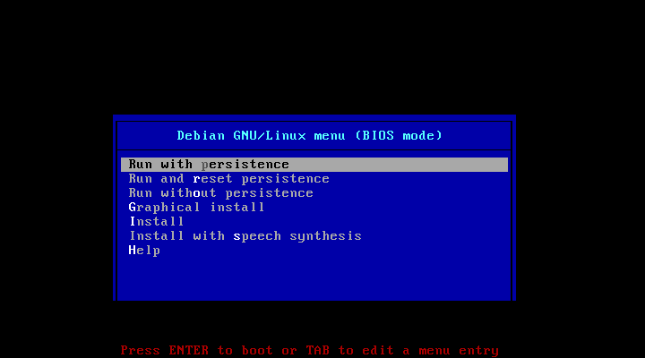
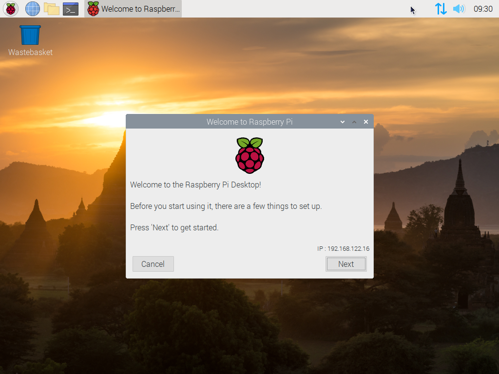

# {{ page.title }}

Keďže aktuálny beh školenia bude prebiehať online, je potrebné sa dobre pripraviť ešte pred začiatkom školenia. Prezenčné školenia prebiehajú v prostredí *IoT Lab*-u na *Technickej univerzite v Košiciach* na minipočítačoch *Raspberry Pi* a s mikrokontrolérmi *ESP32*. Preto aj túto online formu sa budem snažiť čo najviac priblížiť prezenčnej forme.

## Ciele

* Nainštalovať potrebné softvérové vybavenie na kurz
* V prípade záujmu zohnať potrebné hardvérové vybavenie

## Minipočítač Raspberry Pi

Pre absolvovanie kurzu vám odporúčam mať vlastný minipočítač *Raspberry Pi* (skrátene *RPi*). Ak ho však nemáte alebo si ho neplánujete zakúpiť, bude sa vás týkať časť *Operačný systém Raspberry Pi OS*.

Ak sa rozhodnete RPi kúpiť, odporúčam vám kúpiť si najnovší model *Raspberry Pi 4* s min. *4GB RAM* a vyššie. Cenová relácia je do *70 Eur*. Objednať si ho môžete napr. z týchto stránok:  
  
* oficiálny [rpishop.cz](https://rpishop.cz/raspberry-pi/1598-raspberry-pi-4-model-b-4gb-ram-765756931182.html?SubmitCurrency=1&id_currency=2) (56.90 Eur)
* [rlx.sk](https://rlx.sk/en/raspberry-pi-single-board-computer-/7156-raspberry-pi-4-model-b-4gb-usb30-2hdmi-4kp602450ghz-80211bgnac-ble50.html) (56.22 Eur)
* [datacomp.sk](https://datacomp.sk/pc-raspberry-pi-4-model-b-4gb-wifi-bt-1000mbps_d390314.html) (63.90 Eur)
* [alza.sk](https://www.alza.sk/raspberry-pi-4-model-b-4gb-ram-d5655286.htm?o=1) (73.90 Eur)

V prípade, že doma nemáte vhodný adaptér a HDMI kábel, tak si nezabudnite kúpiť aj
* USB-C adaptér minimálne *5V/3A* (okolo 10 Eur), a
* HDMI-microHDMI kábe/adaptér (do 10 Eur)
* micro SD kartu min *8GB*, ale odporúčam aspoň *16GB*

Návod na to, ako začať pracovať s minipočítačom *Raspberry Pi* a ako ho nainštalovať, nájdete v príručke [Začíname s Raspberry Pi](https://projects.raspberrypi.org/sk-SK/projects/raspberry-pi-getting-started).

## Operačný systém Raspberry Pi OS

Operačný systém [Raspberry Pi OS](https://www.raspberrypi.org/software/) sa používa na minipočítačoch *Raspberry Pi*. Podobne, ako v prípade samotného minipočítača, aj tento operačný systém a hlavne jeho softvérové vybavenie bolo navrhnuté tak, aby bol pripravený pre použitie v školách. Obsahuje teda všetko potrebné, čo budeme používať aj počas tohto školenia. Zvyšok si v prípade potreby doinštalujeme.

Ak teda nemáte k dispozícii minipočítač *Raspberry Pi* alebo pre svoju prácu nepoužívate *linuxový OS*, existuje verzia [Raspberry Pi Desktop](https://www.raspberrypi.org/software/raspberry-pi-desktop/), ktorú je možné používať na bežných PC a Mac. Pre potreby kurzu bude stačiť, ak si túto verziu operačného systému nainštalujete na USB kľúč, z ktorého potom necháte váš osobný  počítač naštartovať (ľudovo povedané *nabootovať*) alebo si pripravíte virtuálny počítač napr. pomocou nástroja [VirtualBox](https://www.virtualbox.org/). 

Je na vás, pre aký spôsob používania sa rozhodnete. Zo skúseností však viem, že je vždy lepšie používať natívny systém ako ten virtualizovaný, pretože sa budete snažiť (zo zvyku) niektoré veci riešiť mimo virtualizovaného počítača. Moje odporúčanie je teda nahrať si systém na samostatný USB kľúč. Ak sa teda rozhodnete pre tento spôsob, pripravte si prázdny USB kľúč o veľkosti min *8GB*, ale odporúčam použiť kľúč o veľkosti aspoň *16GB*.

**Poznámka:** Táto verzia má oproti verzii pre minipočítač RPi isté obmedzenia. Tie ale našu online prácu veľmi neovplyvnia.

### Inštalácia Raspberry Pi Desktop na USB kľúč

1. Zo stránky [www.balena.io/etcher](https://www.balena.io/etcher/) si stiahnite a nainštalujte nástroj *Etcher* pre váš operačný systém.

2. Zo stránky [Raspberry Pi Desktop for PC and Mac](https://www.raspberrypi.org/software/raspberry-pi-desktop/) si stiahnite obraz operačného systému (veľkosť je okolo 3GB). Priamy odkaz na stiahnutie je [tu](https://downloads.raspberrypi.org/rpd_x86/images/rpd_x86-2021-01-12/2021-01-11-raspios-buster-i386.iso).

3. Spustite nainštalovaný nástroj *Etcher*.

4. Kliknite na tlačidlo *Flash from file* a vyberte stiahnutý súbor v kroku 2 s obrazom operačného systému *Raspberry Pi OS*.

5. Pokiaľ aplikácia nevyberie automaticky váš USB kľúč, kliknite na tlačidlo *Select target* a vyberte ho ručne.

6. Nakoniec kliknite na tlačidlo *Flash!*, čím sa začne systém nahrávať na váš USB kľúč. Táto operácia bude trvať niekoľko minút a po jej skončení vás na to aplikácia upozorní.

### Zavedenie systému z vášho USB kľúča

1. Zasuňte USB kľúč do vášho počítača a zapnite (reštartujte) ho.

2. Pri štartovaní vyberte ako bootovacie zariadenie váš USB kľúč.  
   Tento proces vyzerá na každom počítači trochu ináč. Obyčajne sa vám na niekoľko sekúnd zobrazí správa o klávesovej skratke, ktorú máte stlačiť, aby sa vám zobrazilo menu pre výber iného zavádzacieho zariadenia (u mňa je to napr. kláves `F12`).
   
3. Po úspešnom navolení sa vám zobrazí ponuka zavádzača.  

   
   
4. Vždy systém spúšťajte s prvou voľbou `Run with persistence`. Tým pádom neprídete o svoju prácu, ktorú si uložíte, ale zostane bezpečne uložená na vašom USB disku.

5. Po chvíli sa systém zavedie a vy sa ocitnete v prostredí operačného systému *Raspberry Pi OS* na vašom domácom počítači.

### Prvé spustenie

Po úspešnom zavedení systému sa vám zobrazí pracovná plocha a spustí sa sprievodca prvým spustením. 

Pomocou srievodcu si postupne vyberte/nastavte:

* krajinu, jazyk a časovú zónu (odporúčam nastaviť slovenské prostredie, ale používať americkú klávesnicu (zaškrtnite voľbu `Use US keyboard`))

* heslo predvoleného používateľa `pi`

* preskočte aktualizáciu softvéru, a

* reštartujte počítač

Po opätovnom spustení systému bude jeho prostredie lokalizované.

### Problémy

* **Nefungujúce WiFi** - Jedná sa o odľahčený systém, kde nie sú predinštalované všetky moduly pre jadro. Tento problém sa dá jednoducho obísť pripojením vášho telefónu k počítaču cez USB kábel a zapnutím voľby *USB Tethering*. Tým bude váš mobilný telefón fungovať ako modem, resp. sieťová karta a pre pripojenie k sieti bude používať pripojenie, ktoré máte zapnuté na telefóne (WiFi alebo mobilné dáta).

## Vlastná elektronika

V rámci školenia sa hráme aj s elektronikou a programujeme aj mikrokontroléry. Tým, že teraz nebudeme spolu v labáku, neviem vám poskytnúť vlastné pomôcky. Pre absolvovanie kurzu ich však nebudete potrebovať, pretože sa bez nich nakoniec zaobídeme. 

V prípade, že ale máte záujem si doma niečo vyskúšať sami, odporúčam si kúpiť:

* mikrokontrolér ESP32
* kontaktné pole
* sadu prepojovacích káblov MALE-FEMALE a MALE-MALE (čím viac tým lepšie, FEMALE-FEMALE asi používať nebudeme)
* LED diódy rozličných farieb (aspoň po kuse červená, zelená, orandžová)
* sadu odporov
* tlačítka
* foto rezistor
* senzor teploty a vlhkosti (ideálne DHT11/22)