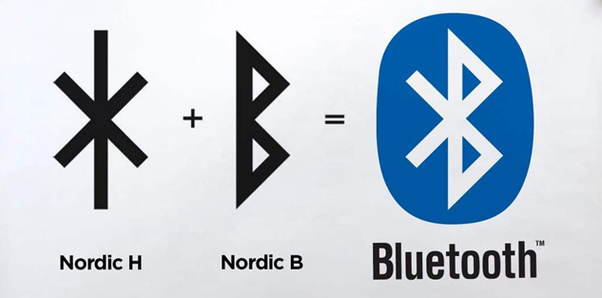

## Technology Overview

* Ericson, 1994 - povodny nazov technologie bol _short link radio technology_
  * Bluetooth sa začalo volať v 1997, podľa dánskeho kráľa _Harald Blåtand_, ktorého priezvisko v preklade znamená práve _Bluetooth_
  * dokonca aj logo je zostavené z iniciáliek kráľa _Blåtand_-a
    
* technológia na bezdrôtový prenos údajov
* identifikácia zariadení pomocou _Bluetooth Device Address_ (BDADDR)
  * podobný princíp ako _Media Access Control_ (MAC) v ethernet-e
* niekoľko verzií
  * bluetooth 1 až 5
  * rozdiely najmä v **dosahu**, **rýchlosti prenosu** a **spotrebe**
* tri triedy _Bluetooth_ zariadení:
  * class 1
  * class 2
  * class 3

### Bluetooth 1.0

* rok 1999
* rýchlosť max 1Mbps
* dosah max 10m
* používala sa modulácia _Gaussian Frequency Shift Keying_ (GFSK)
* použitie v bezdrôtových ovládačoch, slúchadlách a reproduktoroch
* (dnes sa s ním už nestretnete)

### Bluetooth 2.0 

* miesto GFSK sa začali používať schémy _p/4 Differential Quadrature Phase-Shift Keying_ (DQPSK) a _8 Differential Phase-Shift Keying_ (DPSK)
* nové schémy umožnili zvýšiť rýchlosť prenosu (teoreticky) do 2.1Mbps
* spotreba znížená o polovicu

### Bluetooth 3.0

* rýchlosti (teoreticky) do 24Mbps
* umožňuje prenos aj veľkých súborov (802.11 link) ??
* známe tiež ako _High Speed Bluetooth_

### Bluetooth 4.0

* znížené napájanie - predstavené _Bluetooth Low Energy_ (známe ako _BLE_ alebo _Bluetooth LE_)
  * vďaka tomu sa _Bluetooth_ stáva zaujímavou technológiou pre senzorické siete
* rýchlosť zostala rovnaká ako v prípade verzie _3.0_

### Bluetooth 5.0

* na trh koncom roka 2016 (resp. začiatkom 2017)
* 4x väčší dosah
  * teoreticky 40m indoor a 200m outdoor
* 2x vyššia rýchlosť
* 8x vyššia priepustnosť údajov (data throughput)
* stáva sa zaujímavou pre _IoT_
* (poziadavka na spatnu kompatibilitu s NFT a RFID)

## Bluetooth Beacons

* princip pouzitia
* protokoly
  * iBeacon (Apple)
  * Eddystone (Google)
  * ine implementacie od spolocnosti/vyrobcov ako Kontak.io, Estimote

## Additional Links

* [Bluetooth Symbol Origin and Meaning](http://www.thewestologist.com/symbols/bluetooth-symbol-origin-and-meaning)
* [What is the origin of the Bluetooth logo?](https://www.quora.com/What-is-the-origin-of-the-Bluetooth-logo)
* [Getting Started with ESP32 Bluetooth Low Energy (BLE) on Arduino IDE](https://randomnerdtutorials.com/esp32-bluetooth-low-energy-ble-arduino-ide/)