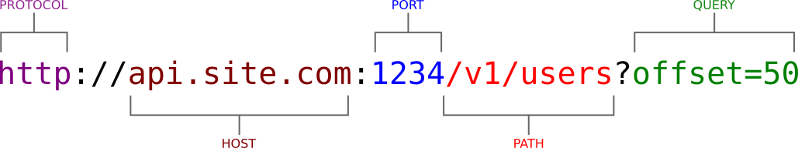

* path
* query params
* url

## REST API

nase REST API bude pouzivat prefix `/api/v1/`

### Resource Files

| path            | method   | meaning                              | status    |
| `/{slug}`       | `GET`    | download file with given `slug`      | `200`     |
| `/files/{slug}` | `GET`    | get file info as JSON document       | `200`     |
| `/files/{slug}` | `DELETE` | delete file with given `slug`        | `200`, `204`  |
| `/files/{slug}` | `PUT`    | full update of file with `slug`      | `200`     |
| `/files/{slug}` | `PATCH`  | partial update of file with `slug`   | `200`     |
| `/files/`       | `POST`   | create/upload new file               | `201`     |
| `/files/`       | `GET`    | return list of files                 | `200`     |

### Resource Users

| path            | method   | meaning |
| `/users/`       | `GET`    | retrieve list of users |
| `/users/{slug}` | `GET`    | retrieve info about given user |
| `/users/`       | `POST`   | create new user |
| `/users/{slug}` | `DELETE` | delete existing user |
| `/users/me`     | `GET`    | shows my profile |

### Others

| path            | method | meaning |
| `/`             | `GET`  | show homepage |
| `/cron/`        | `GET`  | starts maintainance |
