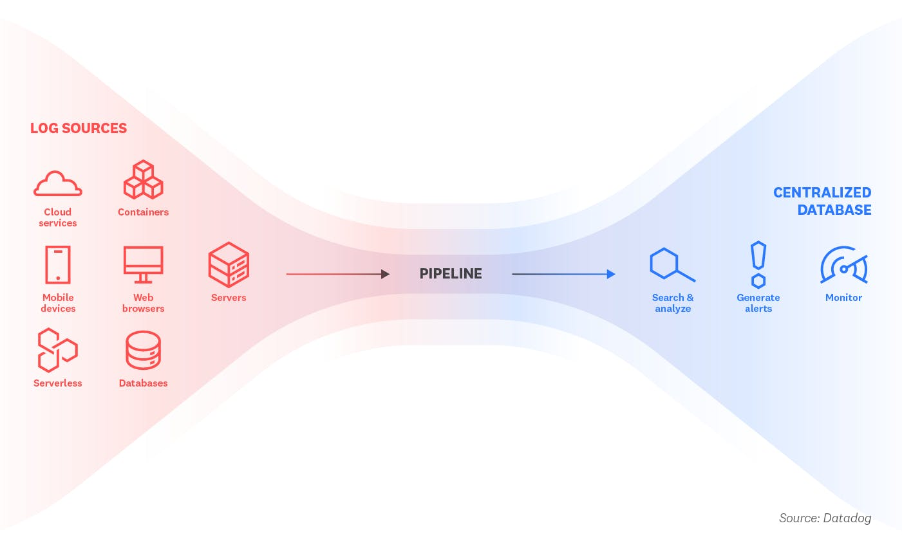
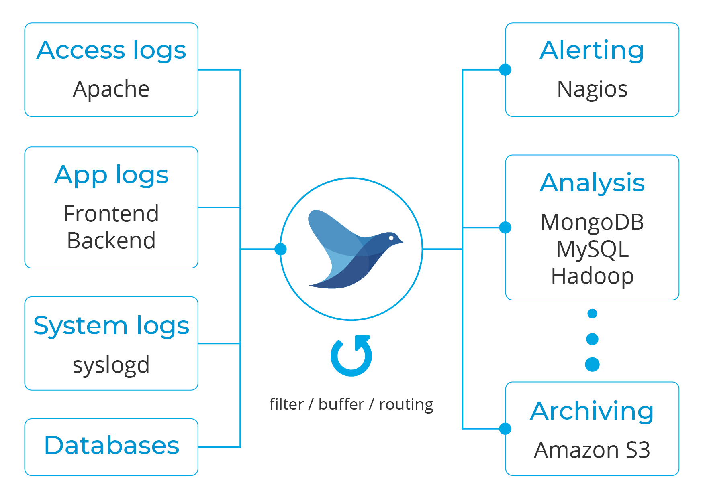

## Čo sú to logy?

* logy postkytujú náhľad na chovanie bežiacej aplikácie. v logoch sa nachádzajú informácie o tom, čo aplikácie robia. 

* logy obsahujú množstvo informácií, ktoré môžu vývojárom pomôcť monitorovať aktivitu a riešiť problémy v rámci ich systému. aby však mohli poskytnúť najväčšiu hodnotu, musia byť systematicky zbierané a štandardizované.

* logovať môžeme:

    * správanie aplikácie - spustenie, vypínanie, ...
    * prístup k jednotlivým súčastiam aplikácie - access logy, pokusy v prístupoch, čo kto a kedy, bezpečnosť
    * ladenie aplikácie - veľmi časté využitie pre analyzovanie správania počas vývoja
    * systémové logy
    * databázy

* logy sú prúdy agregovaných a časovo zoradených udalostí. obyčajne sú reprezentované v textovom formáte a v súbore s logmi sa na jednom riadku nachádza práve jedna udalosť. nemajú žiadny pevný začiatok ani koniec, ale plynulo prúdia počas celého behu aplikácie.

* v prostredí kontajnerov sa však logy zapisujú na štandardný výstup (`stdout`). počas ladenia a vývoja aplikácie tak programátor vždy vidí, čo sa deje.

* v produkcii sú logy z aplikácie presmerované do jedného alebo viacerých cieľových destinácií určených pre zobrazenie alebo archiváciu logov. tieto destinácie nie sú pre aplikáciu viditeľné ani konfigurovateľné. 

## Ako aplikácie logujú dáta?

* zapisujú ich do súborov (tzv. `logfile`) - takto organizované logy však nie sú pre bežných používateľov, ich analýza je náročná, ak sa má vykonávať ručne a logy sa nachádzajú vo viacerých súboroch, problémom môže byť aj rozličný formát
* logovať priamo do DB - napr. Elastic, aplikácia musí mať konfiguráciu

## Čo je to agregácia logov?

* Log aggregation is the process of collecting, standardizing, and consolidating log data from across an IT environment in order to facilitate streamlined log analysis. Without log aggregation, developers would have to manually organize, prepare, and search through log data from numerous sources in order to extract useful information from it.

* agregácia logov je prvým krokom pre ich ďalšie spracovanie a môže byť dosiahnuté rozličnými metódami, ako napr.:

    * replikácia súborov - Priebežne sú súbory s logmi presúvané na cieľové miesto, kde sú ďalej spracovávané. Častokrát sa môže jednať o kombináciu nástrojov ako `rsync` a `cron`. Nejedná sa však o monitorovanie v reálnom čase a často môže vďaka výpadku systému dôjsť k strate príslušných logov.

    * syslog - Logy môžu byť smerované do centrálneho úložiska, ktoré je spravované systémovou službou. Jedná sa o pomerne jednoduchú metódu, ale môže byť ťažšie škálovateľná.

    * automatizované pipeliny - Jedná sa o kombináciu viacerých nástrojov a prístupov, kedy vďaka týmto automatizovaným pipeline-ám dochádza k neustálemu parsovaniu, indexovaniu a preposielaniu logov na vzdialené úložisko. Niektoré systémy môžu byť vybavené aj včasným notifikovaním na základe vykonanej analýzy.

      

## Prečo agregovať logy

* uloženie logov vzdialene môže mať obrovské výhody pri skúmaní správania sa aplikácie, napr.:

    * pri vyhľadávaní, filtrovaní a zoskupovaní logov
    * pri riešení problémov
    * pri analyzovaní dát (napr. vykreslenie trendov)
    * monitorovanie v reálnom čase - aktívne notifikovanie (alerting) na základe definovaných heuristík (napr. ak množstvo chýb za minútu presiahne stanovenú hranicu)

* pri výbere agregátora treba pozerať na vlastnosti ako

    * zvláda viacero formátov, ktoré si potom dokáže uložiť do jednotného formátu
    * dokáže ich ďalej spracovať alebo prepojiť s ďalšími nástrojmi na analýzu

## Fluentd

## Additional Links

* The Twelve-Factor App: [Logs](https://12factor.net/cs/logs)
* Youtube: [How Fluentd simplifies collecting and consuming logs](https://www.youtube.com/watch?v=5ofsNyHZwWE)

