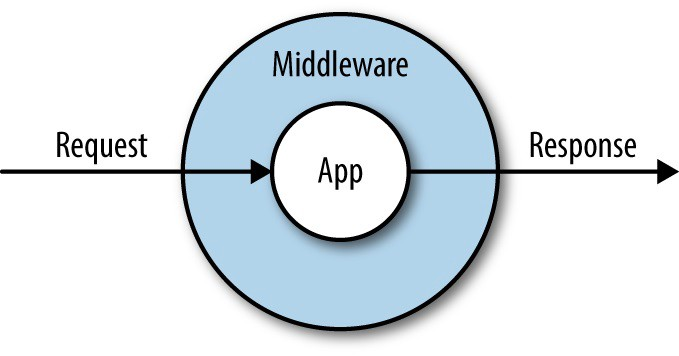

## Co je to middleware?



A **middleware** is a function that works with every **request** before it is processed by any specific path operation. And also with every **response** before returning it.

* It takes each **request** that comes to your application.
* It can then do something to that **request** or run any needed code.
* Then it passes the **request** to be processed by the rest of the application (by some path operation).
* It then takes the **response** generated by the application (by some path operation).
* It can do something to that **response** or run any needed code.
* Then it returns the **response**.


## Priklad

vytvorime samostatny modul s nazvom `middleware.py` a do neho pridame tento kod:

```python
async def add_process_time_header(request: Request, call_next):
    start_time = time.time()
    response = await call_next(request)
    process_time = time.time() - start_time
    response.headers["X-Process-Time"] = str(process_time)
    return response
```

V hlavnom module aplikacie pridame tento vytvoreny middleware to aplikacie:

```python
from starlette.middleware.base import BaseHTTPMiddleware

app.add_middleware(BaseHTTPMiddleware, dispatch=add_process_time_header)
```


## Middleware ako trieda

definicia:

```python
class AddProcessTimeHeader(BaseHTTPMiddleware):
    async def dispatch(self, request: Request, call_next):
        start_time = time.time()
        response = await call_next(request)
        process_time = time.time() - start_time
        response.headers["X-Process-Time"] = str(process_time)
        return response
```

pouzitie:

```python
app.add_middleware(AddProcessTimeHeader)
```


## Prometheus Middleware

https://github.com/perdy/starlette-prometheus

najprv nainstalujeme

```bash
$ pip install starlette-prometheus
```

pridame do aplikacie:

```python
from starlette_prometheus import metrics, PrometheusMiddleware

app.add_middleware(PrometheusMiddleware)
app.add_route('/metrics', metrics)
```

a vyskusame:

http://localhost:8000/metrics


## Odkazy

* FastAPI: [Middleware](https://fastapi.tiangolo.com/tutorial/middleware/)
