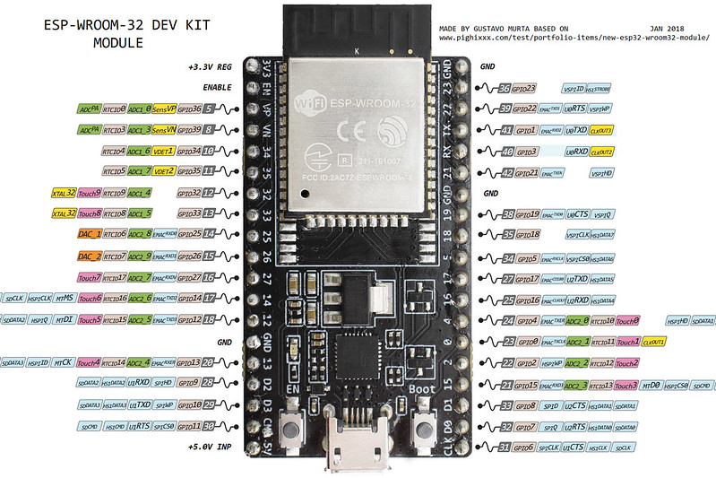
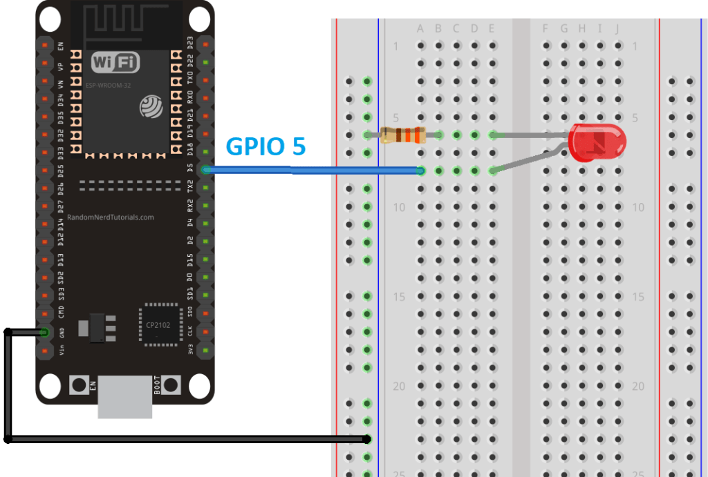

## GPIO Piny

* skratka od _General Purpose Input Output_

### ESP-WROOM-32 Pinout

[](https://www.flickr.com/photos/jgustavoam/40089095211/in/photostream/)


## Práca s GPIO pinom v ESP32

* trieda `machine.Pin`

* `pin` objekt sa používa na riadenie GPIO pinu

* je asociovaný s fyzickým pin-om

* umožňuje
    * nastaviť režim prístupu (`IN`, `OUT`, ...)
    * čítanie/zápis na pin

* použitie
    ```python
    from machine import Pin
    pin = Pin(23, Pin.OUT)
    pin.on()
    ```

## Rozsvietenie LED diódy

* zapojenie nakresliť na tabuľu
    * zapojiť led-ku medzi 3.3V a zem
    * nezabudnúť na odpor a vypočítať jeho veľkosť podľa ohmovho zákona
    * ak je všetko v poriadku, led-ka svieti

* rozpojiť 3.3V a zapojiť ho podľa schémy na GPIO pin 5
    

* naprogramovať
    ```python
    from machine import Pin
    from time import sleep

    print(autor)
    led = Pin(5, Pin.OUT)

    while True:
        led.on()
        sleep(1)
        led.off()
        sleep(0.5)
    ```


## Let's Build a Python LED Class

* odbočka - môžeme vytvárať triedy, ktoré reprezentujú príslušné senzory alebo akčné členy


## Digitálny vstup


## Lab: Indiana Jones Theme


* kuknime si na oázu zariadení poháňaných ESP32 s kopcom digitálnych vstupov:

<iframe width="560" height="315" src="https://www.youtube.com/embed/aADExWV1bsM" frameborder="0" allow="accelerometer; autoplay; encrypted-media; gyroscope; picture-in-picture" allowfullscreen></iframe>

* spravme zabezpečovací mechanizmus pre _Golden Idol_

* ako však zabezpečili, aby ten mechanizmus fungoval aj po tisíckach rokov?


## Linky
* [ESP32 DevKit ESP32-WROOM GPIO Pinout](https://circuits4you.com/2018/12/31/esp32-devkit-esp32-wroom-gpio-pinout/)
* [class Pin – control I/O pins](http://docs.micropython.org/en/latest/library/machine.Pin.html#machine-pin)
