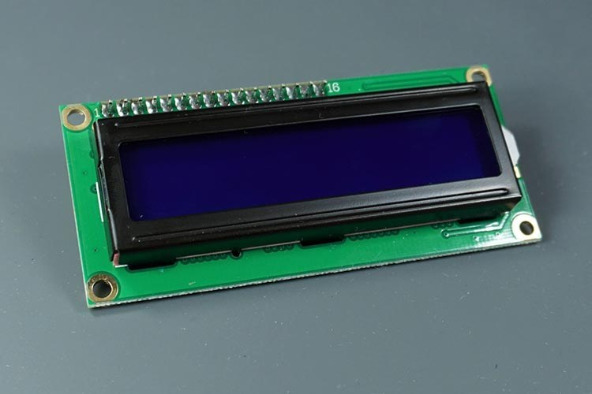
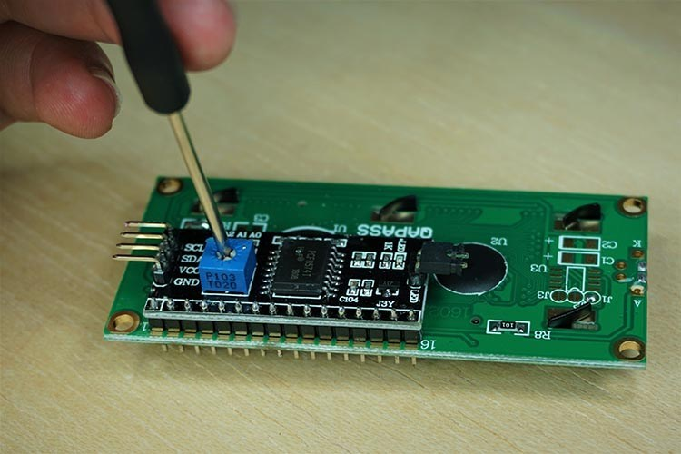

## 16x2 I2C LCD display

* Použijeme LCD display s dvoma riadkami a 16-imi stĺpcami. Pre pripojenie budeme používať I2C adaptér, ktorým je osadený.

    


## Inštalácia

* prejdite na stránku https://github.com/dhylands/python_lcd

* z priečinku `lcd/` si do svojho _ESP32_ prekopírujte tieto súbory:
    * `esp8266_i2c_lcd.py`
    * `lcd_api.py`

* odskúšať LCD display môžete súborom s príkladom `esp8266_i2c_lcd_test.py`
    * piny pre _I2C_ na riadok _14_ upravte podľa svojho zapojenia, napr:

       ```python
       i2c = I2C(scl=Pin(22), sda=Pin(21), freq=400000)
       ```

* ak by sa vám náhodou nič nezobrazovalo a Python nebude vypisovať žiadne chyby, skúste si nastaviť kontrast pomocou potenciometra na zadnej strane:

    


## LCD API

* `I2cLcd(i2c, i2c_address, rows, cols)` - konštruktor, ktorý vytvorí inštanciu display-a
    * `i2c` - inštancia `I2C`
    * `i2c_address` - I2C adresa display-a
    * `rows` - počet riadkov display-a
    * `cols` - počet stĺpcov display-a

* `clear()` - Clears the LCD display and moves the cursor to the top left corner.

* `show_cursor()` - Causes the cursor to be made visible.

* `hide_cursor()` - Causes the cursor to be hidden.

* `blink_cursor_on()` - Turns on the cursor, and makes it blink.

* `blink_cursor_off()` - Turns on the cursor, and makes it no blink (i.e. be solid).

* `display_on()` - Turns on (i.e. unblanks) the LCD.

* `display_off()` - Turns off (i.e. blanks) the LCD.

* `backlight_on()` - Turns the backlight on.

* `backlight_off()` - Turns the backlight off.

* `move_to(cursor_x, cursor_y)` - Moves the cursor position to the indicated position. The cursor position is zero based (i.e. cursor_x == 0 indicates first column). 

* `putchar(char)` - Writes the indicated character to the LCD at the current cursor position, and advances the cursor by one position. 

* `putstr(string)` - Write the indicated string to the LCD at the current cursor position and advances the cursor position appropriately.

* `custom_char(location, charmap)` - Write a character to one of the 8 CGRAM locations, available as `chr(0)` through `chr(7)`.


## Example

```python
from machine import I2C, Pin
from esp8266_i2c_lcd import I2cLcd

i2c = I2C(scl=Pin(22), sda=Pin(21))
lcd = I2cLcd(i2c, 39, 2, 16)
lcd.putstr('Hello world!')
```


## Links

* [How to Use I2C LCD with ESP32 on Arduino IDE (ESP8266 compatible)](https://randomnerdtutorials.com/esp32-esp8266-i2c-lcd-arduino-ide/)
* https://github.com/dhylands/python_lcd

