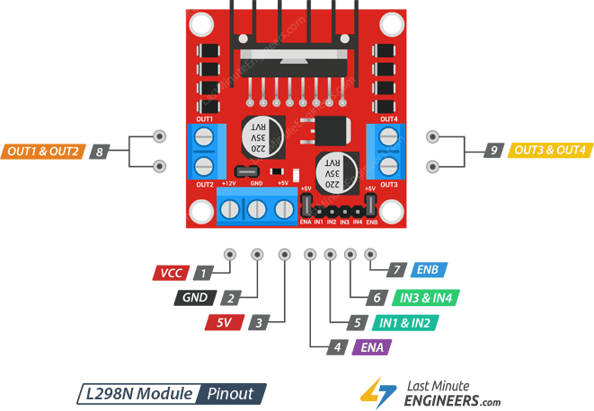

## H-mostík

* názov vznikol podľa toho, že zapojenie je v tvare písmena _H_

* Pozostáva zo štyroch prepínačov, kde sa na motor privedie napätie na základe kombinácie zapojenia dvoch z nich. Tým sa raz motor otáča vľavo alebo vpravo. Ukážka:

  

* Ako prepínače sú použité tranzistory.

## Pulse-Width Modulation

### Introduction

* pulzne šírková modulácia

* PWM môže byť použité na vytvorenie ilúzie, že LED dióda môže mať niekoľko úrovní jasu. Túto ilúziu získame tým, že budeme LED diódu neustále rozsvecovať a zhasínať v priebehu približne _500_ cyklov za sekundu. Jas, ktorý dosiahneme, je stanovený z množstva času, v ktorom je LED dióda zapnutá voči času, v ktorom je LED dióda vypnutá. Čím bude dlhší pracovný cyklus (dlhší čas bude PIN nastavený na hodnotu _1_ než na hodnotu _0_), tým vyšší jas bude LED dióda mať.

* V tomto prípade sa jedná o akýsi podvod pre naše oko. To totiž nie je schopné zaznamenať blikanie rýchlejšie ako _50_ cyklov za sekundu. Ak je totiž vyššie, dióda sa bude javiť ako svietiaca.

* Pozrime sa teda na to, ako taký pracovný cyklus vyzerá.
  

* A pozrime sa tiež na niekoľko rozličných pracovných cyklov. Čím je teda šírka pulzu nižšia, tým je aj nižší celkový výsledný výkon, resp. v našom prípade to bude úroveň jasu. Čím je naopak šírka pulzu vyššia, tým bude vyšší aj výsledný výkon, resp. úroveň jasu.
  

* Na _Arduino UNO_ je ako PWM piny možné využiť digitálne PIN-y _3_, _5_, _6_, _9_, _10_ a _11_. Pre úplnosť je potrebné dodať, že pre svoju činnosť PWM používa časovače mikrokontroléra _ATmega_.

* Na _ESP32_ je možné ako PWM piny využiť všetky výstupné digitálne piny. Ukážka použitia:

  ```python
  from machine import Pin, PWM
  
  pwm0 = PWM(Pin(0))      # create PWM object from a pin
  pwm0.freq()             # get current frequency
  pwm0.freq(1000)         # set frequency
  pwm0.duty()             # get current duty cycle
  pwm0.duty(200)          # set duty cycle
  pwm0.deinit()           # turn off PWM on the pin
  
  pwm2 = PWM(Pin(2), freq=20000, duty=512) # create and configure in one go
  ```

## Labák: Diaľkové robotické autíčko

Autíčko bude ovládané pomocou príkazov posielaných cez MQTT na diaľku. Pri stavbe sa predpokladá, že _ESP32_ je má funkčné internetové spojenie.

Zoznam materiálu:

* 2x DC motor
* 2x kolieska
* dvojkanálový h-mostík L298N
* batérie (4x1.5V alebo 1x9V) s battery box-om
* analógový joystick
* 2x ESP32
* buď originálny podvozok pre autíčko alebo kus kartónu
* lepiaca pištoľ
* lepiace pásky

### Stavba autíčka

Pre zapojenie motorčekov budeme používať dvojkanálový H-mostík v module L298N. Rozloženie pinov je na nasledujúcom obrázku:



Motorčeky sa pripájajú na piny `OUT1`, `OUT2` (prvý motorček) a na piny `OUT3` a `OUT4` (druhý motorček).

Na pin `VCC` je potrebné priviesť vstupné napätie v rozsahu od _6V_ do _12V_. V prípade, že je sa jumper nad svorkami _VCC_ a _GND_ nachádza na svojom mieste, zo svorky _5V_ je možné odoberať napätie _5V_ pre _ESP32_.

Na riadenie smeru a rýchlosti motorčekov sa používaju piny `ENA`, `IN1`, `IN2` (prvý motorček) a `ENB`, `IN3`, `IN4` (druhý motorček). Motorček bude ovládateľný vtedy, keď sa na pin `ENA` (alebo `ENB`) privedie logická úroveň `HIGH`. Následne je možné kombináciou pinov `IN1` a `IN2` (poprípade `IN3` a `IN4` pre druhý motorček) ovládať smer otáčania koliesok. Rýchlosť otáčania je možné riadať `PWM` signálom, ktorý sa privádza na piny `ENA` a `ENB`.

Smer otáčania sa nachádza v nasledovnej tabuľke. Podobne je možné smer otáčania odvodiť aj pre druhý motorček.

|   direction    | `IN1` | `IN2` |
| :------------: | :---: | :---: |
| motorček stojí |  _0_  |  _0_  |
|    dopredu     |  _1_  |  _0_  |
|     dozadu     |  _0_  |  _1_  |
| motorček stojí |  _1_  |  _1_  |

Zapojenie jedného motorčeka je znázornené na nasledujúcej schéme. Mikrokontrolér _ESP32_ na obrázku je len orientačný. Preto sa neriaďte jeho rozložením pinov, ale overte si ich so svojím mikrokontrolérom.


Pre opis motorčeka použijeme triedu `DCMotor` ukradnutú zo stránok [Random Nerd Tutorials](https://randomnerdtutorials.com/). Jej výpis sa nachádza nižšie:

```python
from machine import Pin, PWM


class DCMotor:
    # the min_duty and max_duty are defined for 15000Hz frequency
    # you can pass as arguments
    def __init__(self, pin1, pin2, enable_pin, min_duty=750, max_duty=1023):
        self.pin1 = pin1
        self.pin2 = pin2
        self.enable_pin = enable_pin
        self.min_duty = min_duty
        self.max_duty = max_duty

    # speed value can be between 0 and 100
    def forward(self, speed):
        self.speed = speed
        self.enable_pin.duty(self.duty_cycle(self.speed))
        self.pin1.value(1)
        self.pin2.value(0)

    def backwards(self, speed):
        self.speed = speed
        self.enable_pin.duty(self.duty_cycle(self.speed))
        self.pin1.value(0)
        self.pin2.value(1)

    def stop(self):
        self.enable_pin.duty(0)
        self.pin1.value(0)
        self.pin2.value(0)

    def duty_cycle(self, speed):
        if self.speed <= 0 or self.speed > 100:
            duty_cycle = 0
        else:
            duty_cycle = int(
                self.min_duty
                + (self.max_duty - self.min_duty) * ((self.speed - 1) / (100 - 1))
            )

        return duty_cycle
```

Pre testovanie môžete z príkazového riadku vytvoriť inštanciu motora, zavolať metódu `forward()`, `backwards()` a `stop()`, aby ste otestovali funkčnosť ako vášho zapojenia, tak aj implementácie:

```python
from time import sleep

motor1 = DCMotor(pin1=Pin(12, Pin.OUT), pin2=Pin(14, Pin.OUT), enable_pin=PWM(Pin(13, Pin.OUT)))

motor1.forward(50)
sleep(2)
motor1.stop()

motor1.backwards(50)
sleep(2)
motor1.stop()
```

Podobným spôsobom zapojíme aj druhý motorček, a vytvoríme druhú inštanciu motora.

Následne vytvoríme fragment kódu, ktorý sa pripojí na _MQTT_ server, prihlási sa na odber správ z témy `iotlab/car/mirek` a po prijatí správy ju ošetrí v metóde `on_message()`:

```python
from umqtt.robust import MQTTClient


def on_message(topic, message):
    topic = topic.decode("utf-8")
    message = message.decode("utf-8")

    print('Message "{}" received in topic "{}"'.format(topic, message))

    if message == 'dopredu':
        motor1.forward(50)
        motor2.forward(50)
    elif message == 'stop':
        motor1.stop()
        motor2.stop()
    elif message == 'dolava':
        motor1.forward(50)
        motor2.stop()
    elif message == 'doprava':
        motor1.stop()
        motor2.forward(50)


client = MQTTClient("mirek-car", "mqtt.kpi.fei.tuke.sk", 80)
client.set_callback(on_message)

client.connect()
client.subscribe("iotlab/car/mirek")
print("Waiting for message...")

while True:
    client.wait_msg()  # blocking call

client.disconnect()
```

Otestovať správnosť implementácie je možné priamo z príkazového riadku pomocou nástroja `mosquitto_pub`, ktorým môžeme posielať správy rovno do autíčka:

```bash
mosquitto_pub -h mqtt.kpi.fei.tuke.sk -p 80 -t "iotlab/car/mirek" -m "dopredu"
mosquitto_pub -h mqtt.kpi.fei.tuke.sk -p 80 -t "iotlab/car/mirek" -m "dolava"
mosquitto_pub -h mqtt.kpi.fei.tuke.sk -p 80 -t "iotlab/car/mirek" -m "doprava"
mosquitto_pub -h mqtt.kpi.fei.tuke.sk -p 80 -t "iotlab/car/mirek" -m "stop"
```

Zostáva už iba oba programy spojiť do jedného a nahrať ho do _ESP32_ ako súbor `main.py`. Tým zabezpečíme, že sa program spustí automaticky po štartnutí mikrokontroléra:

```python
from machine import Pin, PWM
from umqtt.robust import MQTTClient


class DCMotor:
    # the min_duty and max_duty are defined for 15000Hz frequency
    # you can pass as arguments
    def __init__(self, pin1, pin2, enable_pin, min_duty=750, max_duty=1023):
        self.pin1 = pin1
        self.pin2 = pin2
        self.enable_pin = enable_pin
        self.min_duty = min_duty
        self.max_duty = max_duty

    # speed value can be between 0 and 100
    def forward(self, speed):
        self.speed = speed
        self.enable_pin.duty(self.duty_cycle(self.speed))
        self.pin1.value(1)
        self.pin2.value(0)

    def backwards(self, speed):
        self.speed = speed
        self.enable_pin.duty(self.duty_cycle(self.speed))
        self.pin1.value(0)
        self.pin2.value(1)

    def stop(self):
        self.enable_pin.duty(0)
        self.pin1.value(0)
        self.pin2.value(0)

    def duty_cycle(self, speed):
        if self.speed <= 0 or self.speed > 100:
            duty_cycle = 0
        else:
            duty_cycle = int(
                self.min_duty
                + (self.max_duty - self.min_duty) * ((self.speed - 1) / (100 - 1))
            )

        return duty_cycle

motor1 = DCMotor(pin1=Pin(12, Pin.OUT), pin2=Pin(14, Pin.OUT), enable_pin=PWM(Pin(13, Pin.OUT)))
motor1.stop()

motor2 = DCMotor(pin1=Pin(15, Pin.OUT), pin2=Pin(16, Pin.OUT), enable_pin=PWM(Pin(17, Pin.OUT)))
motor2.stop()

def on_message(topic, message):
    topic = topic.decode("utf-8")
    message = message.decode("utf-8")

    print('Message "{}" received in topic "{}"'.format(topic, message))

    if message == 'dopredu':
        motor1.forward(50)
        motor2.forward(50)
    elif message == 'stop':
        motor1.stop()
        motor2.stop()
    elif message == 'dolava':
        motor1.forward(50)
        motor2.stop()
    elif message == 'doprava':
        motor1.stop()
        motor2.forward(50)


client = MQTTClient("mirek-car", "mqtt.kpi.fei.tuke.sk", 80)
client.set_callback(on_message)

client.connect()
client.subscribe("iotlab/car/mirek")
print("Waiting for message...")

while True:
    client.wait_msg()  # blocking call

client.disconnect()
```

Následne je možné odpojiť USB kábel a priviesť _5V_ z H-mostíka _L298N_ na pin _VCC_ (alebo _5V_) na mikrokontrolér. Tým pádom vie mikrokontrolér fungovať samostatne.

### Diaľkový ovládač

Ako ovládač budeme používať analógový joystick, ktorý pripojíme k _ESP32_. Na základe zmeny pohybu pomocou joystick-u sa budú posielať správy do _MQTT broker_-a. 


Joystick je možné pripojiť na priamo k _ESP32_. Zmena smeru je reprezentovaná analógovým signálom, ktorý je možné čítať z pinov `VRx` a `VRy` joysitcku. Výstupy z týchto pinov pripojíme na 2 analógové piny na _ESP32_  a to `32` a `33`. Joystick obsahuje aj tlačidlo, ktoré je možné stlačiť zatlačením joysticku. Jedná sa o digitálny výstup, ktorý je možné prečítať z pinu označeného ako `SW`. Ten pripojíme na pin `25` s parametrom `Pin.PULL_UP`.

Veľkosť analógového signálu bude v rozmedzí od _0V_ po _3.3V_. Preto upravíme konfiguráciu analógových pinov tak, aby s tým rátali:

```python
pin.atten(ADC.ATTN_11DB)
```

Jednoduchý fragment kódu na otestovanie joysticku môže vyzerať nasledovne:

```python
from machine import Pin, ADC
from time import sleep


dx = ADC(Pin(32))
dx.atten(ADC.ATTN_11DB)

dy = ADC(Pin(33))
dy.atten(ADC.ATTN_11DB)

button = Pin(25, Pin.IN, Pin.PULL_UP)

while True:
    print("dy: {} dx: {} button: {}".format(dy.read(), dx.read(), button.value()))
    sleep(0.5)
```

Následne už len kód upravíme tak, aby v príslušných smeroch sme poslali správnu správu do _MQTT broker_-a:

```python
from machine import Pin, ADC
from time import sleep
from umqtt.robust import MQTTClient

TOPIC = 'iotlab/car/mirek'
client = MQTTClient('mirek-joystick', 'mqtt.kpi.fei.tuke.sk', 80)

dx = ADC(Pin(32))
dx.atten(ADC.ATTN_11DB)

dy = ADC(Pin(33))
dy.atten(ADC.ATTN_11DB)

button = Pin(25, Pin.IN, Pin.PULL_UP)

while True:
    if dy.read() == 0:
        client.connect()
        client.publish(TOPIC, 'dopredu')
        client.disconnect()
    elif dy.read() == 4095:
        client.connect()
        client.publish(TOPIC, 'stop')
        client.disconnect()

    if dx.read() == 0:
        client.connect()
        client.publish(TOPIC, 'dolava')
        client.disconnect()
    elif dx.read() == 4095:
        client.connect()
        client.publish(TOPIC, 'doprava')
        client.disconnect()

    print("dy: {} dx: {} button: {}".format(dy.read(), dx.read(), button.value()))
    sleep(0.5)
```

**Poznámka:** V závislosti od kvality joysticku je dobré uvažovať aj o istej tolerancii smeru. Teda pri tolerancii _100_ používať miesto absolútnych hodnôt _0_ a _4095_ porovnávať hodnotu _<100_ miesto _0_ a porovnávať hodnotu _>3995_ miesto _4095_. 

## Links

* [PWM (pulse width modulation)](https://docs.micropython.org/en/latest/esp32/quickref.html#pwm-pulse-width-modulation) - na ESP32
* [ESP32 with DC Motor and L298N Motor Driver – Control Speed and Direction](https://randomnerdtutorials.com/esp32-dc-motor-l298n-motor-driver-control-speed-direction/)
* [Interface L298N DC Motor Driver Module with Arduino](https://lastminuteengineers.com/l298n-dc-stepper-driver-arduino-tutorial/)
* [How 2-Axis Joystick Works & Interface with Arduino + Processing](https://lastminuteengineers.com/joystick-interfacing-arduino-processing/)
* [L298N with ESP8266](https://out-of-cheese-error.netlify.com/l298n-with-esp8266.html) - Driving a DC motor with Huzzah
