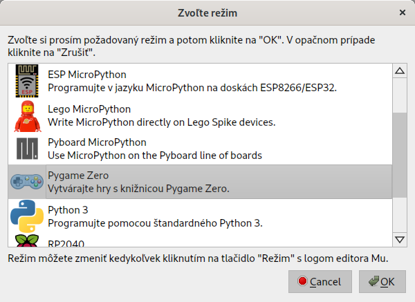
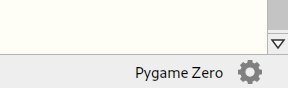
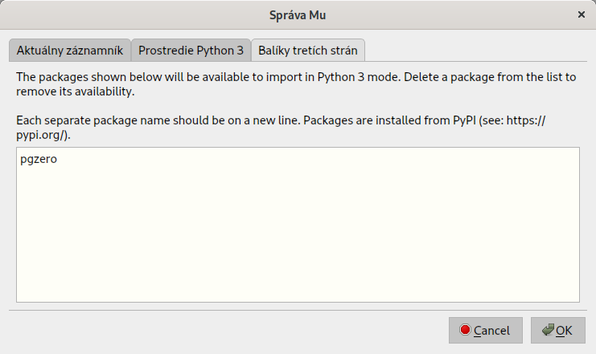
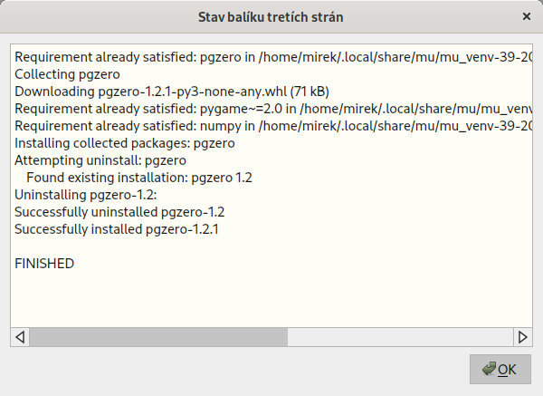
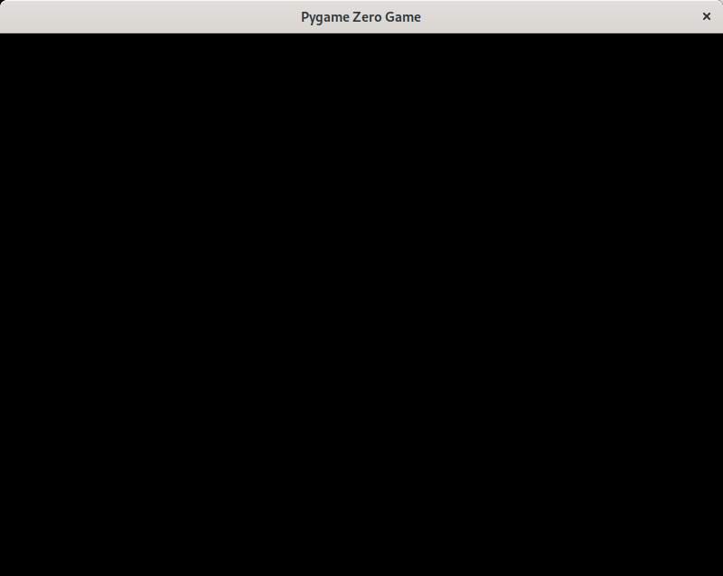
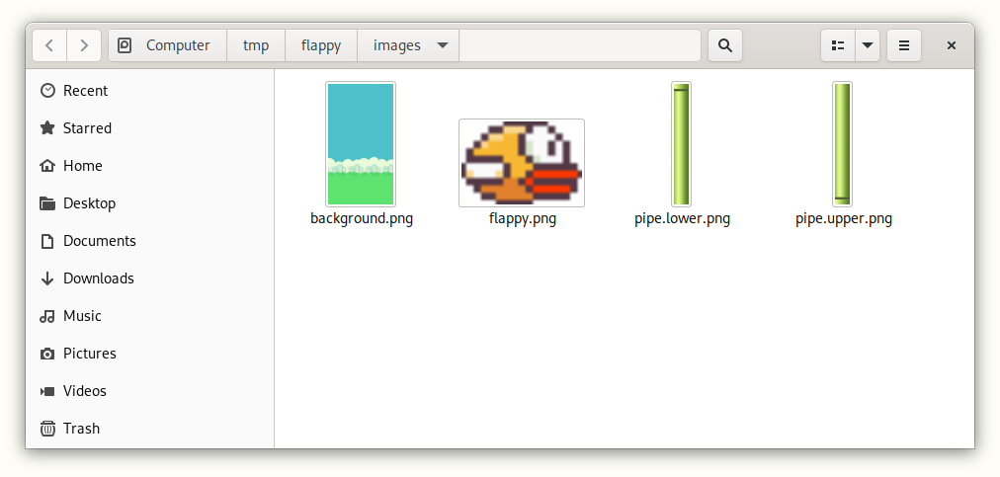
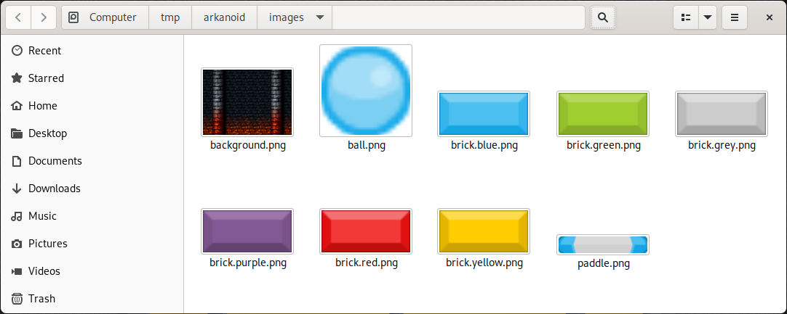

## Ciele

* Nainštalovať potrebné softvérové vybavenie na kurz

* V prípade záujmu zohnať potrebné hardvérové vybavenie


## Ak používate MS Windows

1. Zo stránky [www.python.org](https://www.python.org) z časti [Downloads](https://www.python.org/downloads/) si stiahnite a nainštalujte jazyk Python.

2. Z domovskej stránky [editora Mu](https://codewith.mu) si v časti [Download](https://codewith.mu/en/download) stiahnite a nainštalujte editor *Mu*.

3. Spustite si nainštalovaný editor *Mu* z ponuky *Štart*. 

   **Poznámka:** Prvé spustenie bude chvíľu trvať. Buďte preto trpezliví.

4. Pri prvom spustení vás privíta obrazovka s voľbou režimu práce. Vyberte si režime *Pygame Zero*.

   

   **Poznámka:** Ak si vyberiete nesprávny režim alebo omylom okno zavriete, nevadí. Režim práce si viete zmeniť vždy kliknutím na prvé tlačidlo v paneli s názvom *Režim*.

5. V pravom dolnom rohu obrazovky editora kliknite vedľa nápisu *Pygame Zero* na zubaté koliesko.

   

6. Vyberte si kartu *Balíky tretích strán* a dovnútra napíšte text:

   ```bash
   pgzero
   ```

   a potvrďte stlačením tlačidla `OK`.

   

   **Poznámka:** Ak sa vám zobrazí prázdne okno bez ničoho, vypnite a zapnite editor a skúste to znova.

7. Následne prebehne inštalácia, po ktorej sa v okne zobrazí nápis: `FINISHED`. Okno zavriete kliknutím na tlačidlo `OK`.

   

8. Kliknite na tlačidlo `Hrať`. Budete vyzvaní na uloženie súboru (aj keď je prázdny), tak ho pomenujte napr. `game.py` a uložte ho. 

9. Ak ste postupovali správne, po uložení sa vám zobrazí prázdne čierne okno.

   

10. Okno zavrite.

11. Práve ste pripravení na zvládnutie webináru a na odštartovanie svojej vlastnej kariéry herného vývojára ;)


## Stiahnutie grafiky pre hru Flappy Bird

1. Stiahnite a rozbaľte si [tento balík](resources/project-flappy.bird.zip) napr. na plochu, aby ste ho nemali ďaleko. Po jeho rozbalení vznikne priečinok `flappy/`, ktorého obsah vyzerá nasledovne:

    ```
    flappy
    ├── game.py
    └── images
        ├── background.png
        ├── flappy.png
        ├── pipe.lower.png
        └── pipe.upper.png
    ```

2. Následne v editore otvorte súbor `game.py` z tohto priečinku.

3. Ak následne kliknete na tlačidlo `Obrázky`, zobrazí sa vám prehliadač súborov s obrázkami pre hru *Flappy Bird*. 

    


## Stiahnutie grafiky pre hru Arkanoid / Breakout

1. Stiahnite a rozbaľte si [tento balík](resources/project-arkanoid.zip) napr. na plochu, aby ste ho nemali ďaleko. Po jeho rozbalení vznikne priečinok `arkanoid/`, ktorého obsah vyzerá nasledovne:

    ```
    flappy
    ├── game.py
    ├── sounds/
    │   ├── hit.01.wav
    │   └── hit.02.wav
    └── images/
        ├── background.png
        ├── ball.png
        ├── brick.purple.png
        ├── brick.red.png
        └── paddle.png
    ```

2. Následne v editore otvorte súbor `game.py` z tohto priečinku.

3. Ak následne kliknete na tlačidlo `Obrázky`, zobrazí sa vám prehliadač súborov s obrázkami pre hru *Arkanoid*. 

    
